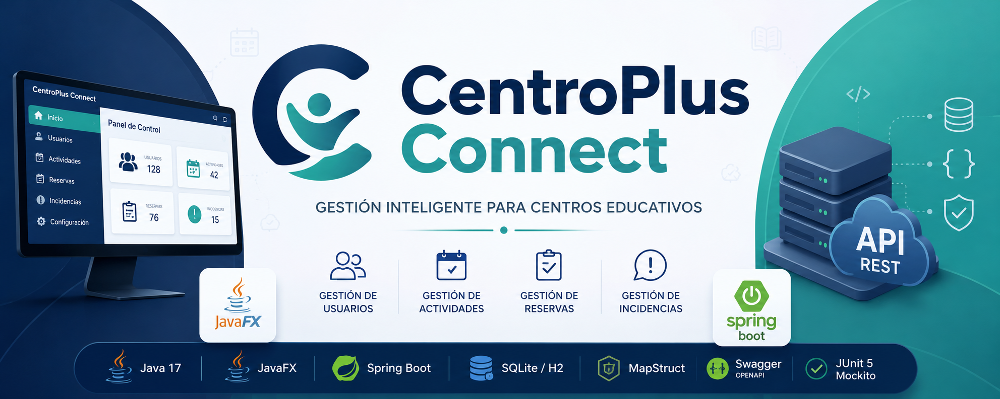

# CentroPlus Connect



CentroPlus Connect es un proyecto desarrollado como solución de gestión para un centro educativo, permitiendo administrar usuarios, actividades, reservas e incidencias mediante una aplicación de escritorio desarrollada en JavaFX y una API REST desarrollada con Spring Boot.

El proyecto ha sido diseñado siguiendo buenas prácticas de desarrollo software, aplicando separación por capas, Arquitectura Hexagonal en el backend y persistencia de datos mediante SQLite y H2.

---

## Funcionalidades principales

### Gestión de usuarios

* Alta de usuarios.
* Consulta de usuarios.
* Modificación de usuarios.
* Eliminación de usuarios.

### Gestión de actividades

* Creación de actividades.
* Consulta de actividades disponibles.
* Gestión de plazas.
* Actualización y eliminación de actividades.

### Gestión de reservas

* Creación de reservas.
* Consulta de reservas.
* Actualización de reservas.
* Cancelación de reservas.

### Gestión de incidencias

* Registro de incidencias.
* Seguimiento del estado.
* Modificación de incidencias.
* Resolución y cierre.

---

## Arquitectura del proyecto

El repositorio se divide en tres bloques principales:

```text
CentroPlus Connect
│
├── backend-api
├── mobile-app
└── database
```

### backend-api

API REST desarrollada con Spring Boot.

Tecnologías principales:

* Java 17
* Spring Boot
* Spring Data JPA
* H2 Database
* MapStruct
* Swagger/OpenAPI
* JUnit 5
* Mockito

Arquitectura:

```text
Controller
    ↓
Service
    ↓
Port
    ↓
Persistence Adapter
    ↓
Repository
    ↓
Database
```

---

### mobile-app

Aplicación de escritorio desarrollada con JavaFX.

Tecnologías principales:

* JavaFX
* FXML
* CSS
* SQLite
* Maven

Arquitectura:

```text
Controller
    ↓
Service
    ↓
Repository
    ↓
SQLite
```

---

### database

Contiene la estructura compartida de la base de datos:

```text
database
├── schema.sql
└── seed.sql
```

Estos scripts permiten recrear la estructura y los datos iniciales utilizados por la aplicación.

---

## Tecnologías utilizadas

| Tecnología      | Uso                      |
| --------------- | ------------------------ |
| Java 17         | Lenguaje principal       |
| JavaFX          | Interfaz gráfica         |
| Spring Boot     | API REST                 |
| Spring Data JPA | Persistencia             |
| SQLite          | Base de datos local      |
| H2              | Base de datos en memoria |
| MapStruct       | Conversión entre capas   |
| Swagger         | Documentación API        |
| Maven           | Gestión de dependencias  |
| JUnit 5         | Testing                  |
| Mockito         | Mocking                  |

---

## Ejecución

### Aplicación JavaFX

```bash
cd mobile-app
mvn clean javafx:run
```

### API REST

```bash
cd backend-api
mvn spring-boot:run
```

Swagger:

```text
http://localhost:8080/swagger-ui/index.html
```

---

## Testing

Ejecutar pruebas:

```bash
mvn test
```

El proyecto incluye pruebas unitarias para:

* Modelos.
* DTOs.
* Servicios.
* Mappers.
* Adaptadores de persistencia.
* Controladores.

---

## Documentación

La documentación detallada se encuentra disponible en:

```text
docs/
├── manual-backend-api.md
└── manual-mobile-app.md
```

---

## Autor

**Alejandro Donate García**

IES Puerto de la Cruz

Proyecto DAM · CentroPlus Connect

---

## Estado del proyecto

✅ Aplicación JavaFX funcional

✅ API REST funcional

✅ CRUD completo de usuarios, actividades, reservas e incidencias

✅ Swagger/OpenAPI

✅ Arquitectura Hexagonal

✅ Persistencia mediante SQLite y H2

✅ Tests unitarios implementados
