# CentroPlus API REST

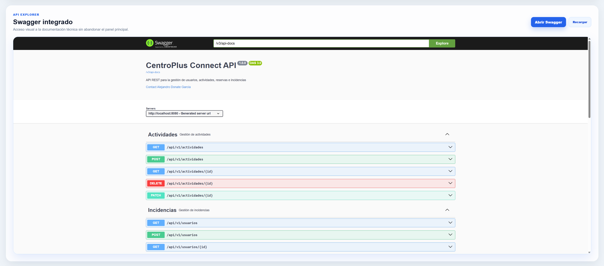

---

# 1. Introducción

CentroPlus API REST es una aplicación desarrollada utilizando Spring Boot cuyo objetivo principal es proporcionar una interfaz de comunicación entre los clientes del sistema CentroPlus Connect y la capa de persistencia de datos.

La API permite gestionar de forma centralizada toda la información relacionada con usuarios, actividades, reservas e incidencias, ofreciendo operaciones CRUD completas (Create, Read, Update y Delete) para cada una de estas entidades.

El proyecto ha sido desarrollado siguiendo los principios de la Arquitectura Hexagonal (Ports and Adapters), permitiendo una clara separación de responsabilidades entre las diferentes capas de la aplicación y favoreciendo la mantenibilidad, escalabilidad y capacidad de prueba del sistema.

Además, se han incorporado herramientas modernas como Spring Data JPA para la persistencia, MapStruct para la conversión entre modelos y entidades, Swagger/OpenAPI para la documentación automática de los endpoints y JUnit junto con Mockito para la realización de pruebas unitarias.

---

# 2. Objetivos del proyecto

La API REST de CentroPlus persigue los siguientes objetivos:

## Objetivo general

Desarrollar un servicio backend robusto y mantenible que permita la gestión integral de la información del centro mediante una arquitectura desacoplada y fácilmente extensible.

## Objetivos específicos

* Gestionar usuarios registrados dentro del sistema.
* Administrar las actividades ofertadas por el centro.
* Gestionar reservas realizadas por los usuarios.
* Registrar y controlar incidencias comunicadas por los usuarios.
* Exponer una interfaz REST accesible desde aplicaciones cliente.
* Mantener una arquitectura limpia basada en principios SOLID.
* Facilitar la realización de pruebas unitarias.
* Proporcionar documentación automática mediante Swagger.

---

# 3. Tecnologías utilizadas

La siguiente imagen muestra las principales tecnologías empleadas durante el desarrollo del proyecto.

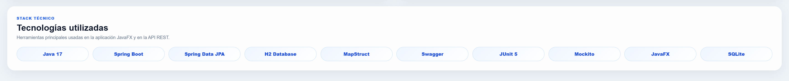

El proyecto ha sido desarrollado utilizando las siguientes tecnologías:

## Java 17

Lenguaje principal utilizado para el desarrollo de toda la aplicación.

## Spring Boot 3

Framework principal utilizado para simplificar la configuración y despliegue de la aplicación.

Entre sus ventajas destacan:

* Configuración automática.
* Integración con Spring Data.
* Integración con Spring MVC.
* Gestión de dependencias.
* Arranque embebido mediante Tomcat.

## Spring Data JPA

Permite abstraer gran parte de las operaciones de persistencia mediante repositorios basados en interfaces.

## H2 Database

Base de datos relacional utilizada durante el desarrollo y las pruebas.

## MapStruct

Framework utilizado para realizar conversiones entre entidades y modelos de dominio.

## Swagger / OpenAPI

Permite generar documentación interactiva de todos los endpoints REST disponibles.

## Maven

Herramienta de gestión y construcción del proyecto.

## JUnit 5 y Mockito

Utilizados para implementar las pruebas unitarias del sistema.

---

# 4. Arquitectura Hexagonal

La aplicación ha sido desarrollada siguiendo el patrón de Arquitectura Hexagonal (Ports and Adapters).

Este enfoque arquitectónico busca desacoplar la lógica de negocio de las tecnologías concretas utilizadas para la entrada y salida de información.

## Flujo de funcionamiento

```text
Cliente
   │
   ▼
Controller
   │
   ▼
Service
   │
   ▼
Port
   │
   ▼
Persistence Adapter
   │
   ▼
Repository JPA
   │
   ▼
Base de Datos
```

La respuesta recorre el camino inverso hasta llegar nuevamente al cliente.

Esta separación facilita la mantenibilidad, el testing y la futura evolución del sistema.

---

# 5. Documentación mediante Swagger

Uno de los aspectos más importantes del proyecto es la integración de Swagger/OpenAPI.

Swagger permite consultar y probar todos los endpoints disponibles directamente desde el navegador sin necesidad de herramientas externas.

## Interfaz principal


Figura 1. Vista principal de la documentación Swagger integrada en CentroPlus Connect.

## Funcionalidades disponibles

Desde Swagger es posible:

* Consultar todos los recursos disponibles.
* Analizar modelos de petición y respuesta.
* Ejecutar operaciones GET, POST, PATCH y DELETE.
* Visualizar códigos de estado HTTP.
* Comprobar el comportamiento de la API en tiempo real.

La documentación se genera automáticamente a partir de los controladores implementados en Spring Boot.

# 6. Endpoints disponibles

La API REST de CentroPlus se organiza en cuatro módulos principales:

* Usuarios
* Actividades
* Reservas
* Incidencias

Además, incorpora un endpoint de monitorización del estado del sistema.

Cada módulo dispone de operaciones CRUD completas mediante los métodos HTTP GET, POST, PATCH y DELETE.

---

# 6.1 Gestión de Usuarios

La gestión de usuarios permite registrar, consultar, modificar y eliminar usuarios dentro del sistema.

## Obtener todos los usuarios

**GET /api/v1/usuarios**

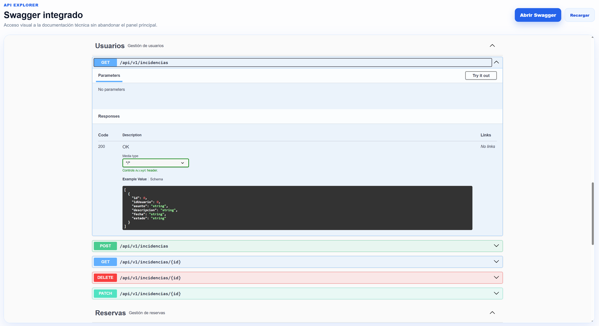

Este endpoint devuelve la colección completa de usuarios registrados.

### Respuesta

```json
[
  {
    "id": 1,
    "nombre": "Juan Pérez",
    "dni": "12345678A",
    "email": "juan@email.com",
    "telefono": "600123123",
    "tipoUsuario": "ALUMNO"
  }
]
```

---

## Crear usuario

**POST /api/v1/usuarios**

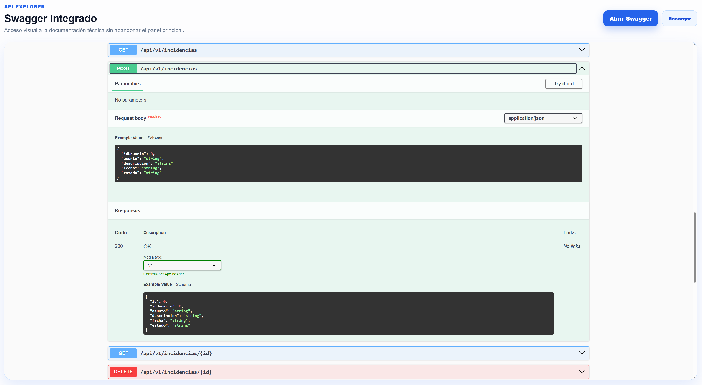

Permite registrar un nuevo usuario en el sistema.

### Cuerpo de la petición

```json
{
  "nombre": "Juan Pérez",
  "dni": "12345678A",
  "email": "juan@email.com",
  "telefono": "600123123",
  "tipoUsuario": "ALUMNO"
}
```

---

## Obtener usuario por ID

**GET /api/v1/usuarios/{id}**

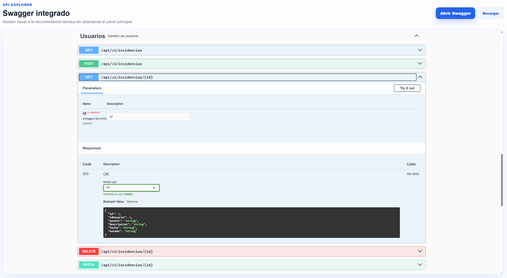

Recupera la información de un usuario específico mediante su identificador.

### Parámetros

| Parámetro | Tipo |
| --------- | ---- |
| id        | Long |

---

## Actualizar usuario

**PATCH /api/v1/usuarios/{id}**

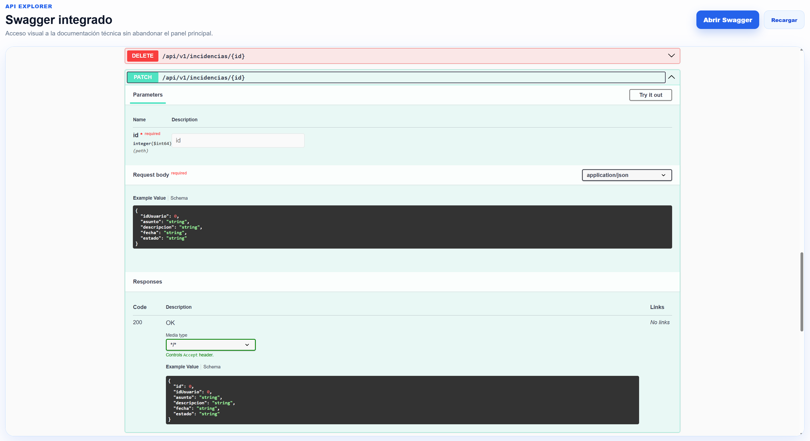

Permite modificar parcialmente la información de un usuario existente.

### Ejemplo

```json
{
  "telefono": "600987654"
}
```

---

## Eliminar usuario

**DELETE /api/v1/usuarios/{id}**

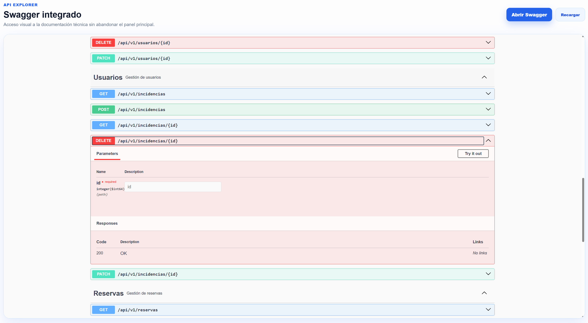

Elimina permanentemente un usuario del sistema.

---

# 6.2 Gestión de Actividades

Las actividades representan los eventos o cursos ofertados por el centro.

## Obtener actividades

**GET /api/v1/actividades**

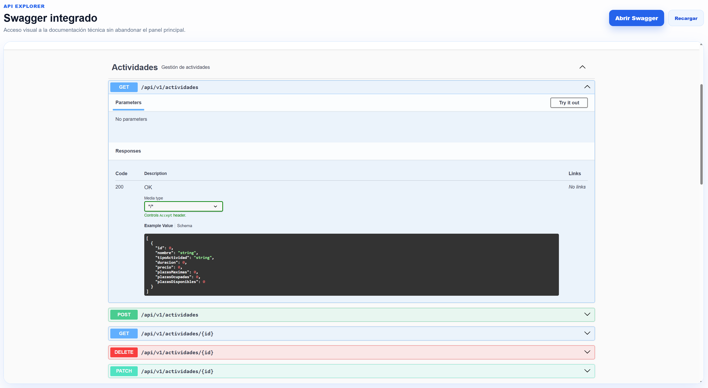

Devuelve el listado completo de actividades registradas.

### Respuesta

```json
[
  {
    "id": 1,
    "nombre": "Curso de Java",
    "descripcion": "Programación Java",
    "plazas": 20
  }
]
```

---

## Crear actividad

**POST /api/v1/actividades**

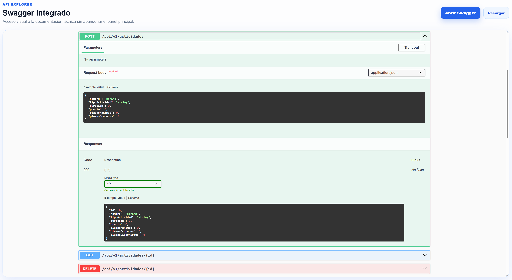

Permite registrar una nueva actividad.

### Cuerpo de la petición

```json
{
  "nombre": "Curso de Java",
  "descripcion": "Programación Java",
  "plazas": 20
}
```

---

## Obtener actividad por ID

**GET /api/v1/actividades/{id}**

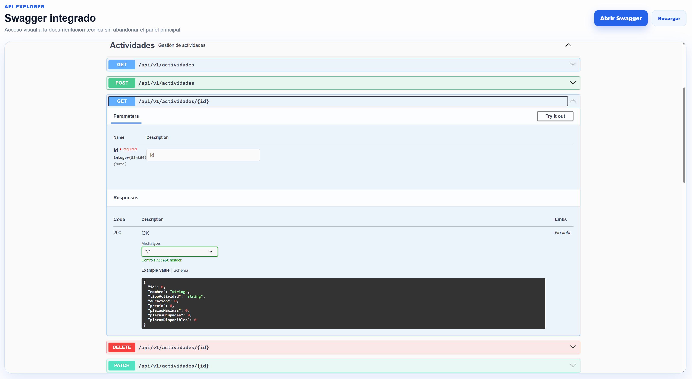

Obtiene la información detallada de una actividad concreta.

---

## Actualizar actividad

**PATCH /api/v1/actividades/{id}**

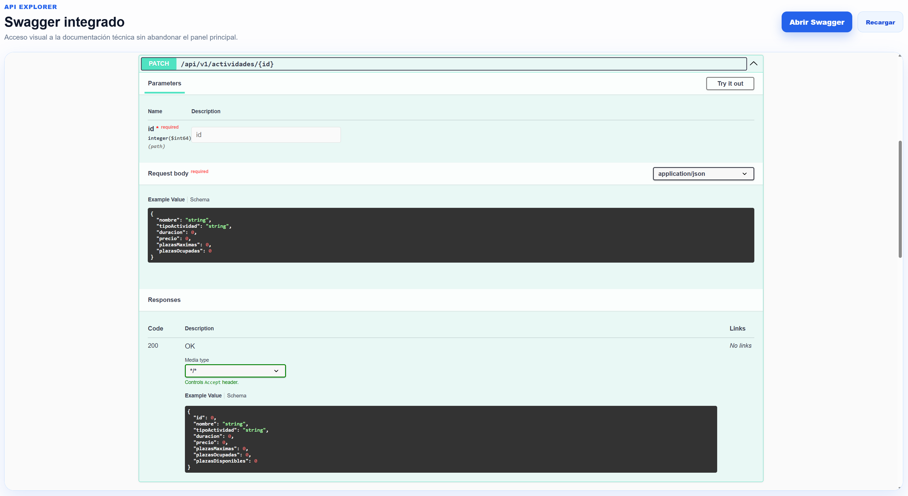

Permite modificar los datos de una actividad existente.

### Ejemplo

```json
{
  "plazas": 25
}
```

---

## Eliminar actividad

**DELETE /api/v1/actividades/{id}**

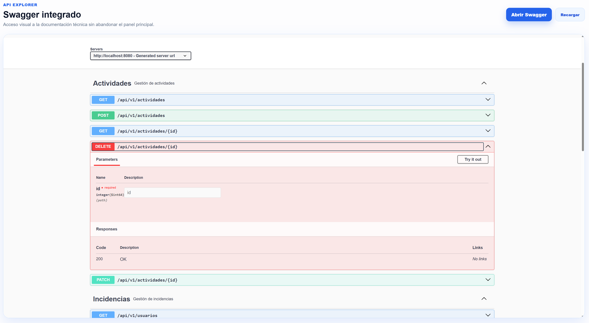

Elimina una actividad del sistema.

# 6.3 Gestión de Reservas

El módulo de reservas permite gestionar la inscripción de usuarios en las actividades disponibles del sistema.

Cada reserva relaciona un usuario con una actividad y almacena información sobre la fecha y estado de la reserva.

---

## Obtener todas las reservas

**GET /api/v1/reservas**

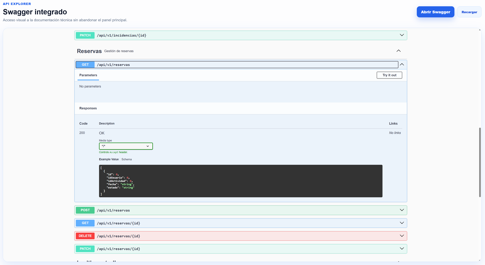

Devuelve el listado completo de reservas registradas.

### Respuesta

```json
[
  {
    "id": 1,
    "idUsuario": 2,
    "idActividad": 3,
    "fecha": "2025-06-15",
    "estado": "ACTIVA"
  }
]
```

---

## Crear reserva

**POST /api/v1/reservas**

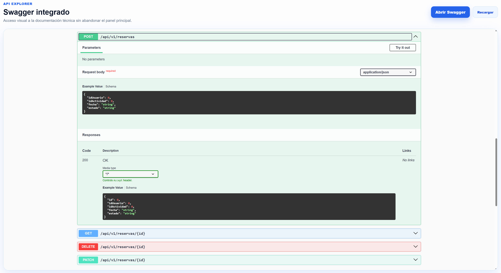

Permite crear una nueva reserva asociando un usuario a una actividad.

### Cuerpo de la petición

```json
{
  "idUsuario": 2,
  "idActividad": 3,
  "fecha": "2025-06-15",
  "estado": "ACTIVA"
}
```

### Respuesta

```json
{
  "id": 1,
  "idUsuario": 2,
  "idActividad": 3,
  "fecha": "2025-06-15",
  "estado": "ACTIVA"
}
```

---

## Obtener reserva por ID

**GET /api/v1/reservas/{id}**


Permite consultar una reserva específica utilizando su identificador.

### Parámetros

| Parámetro | Tipo |
| --------- | ---- |
| id        | Long |

---

## Actualizar reserva

**PATCH /api/v1/reservas/{id}**

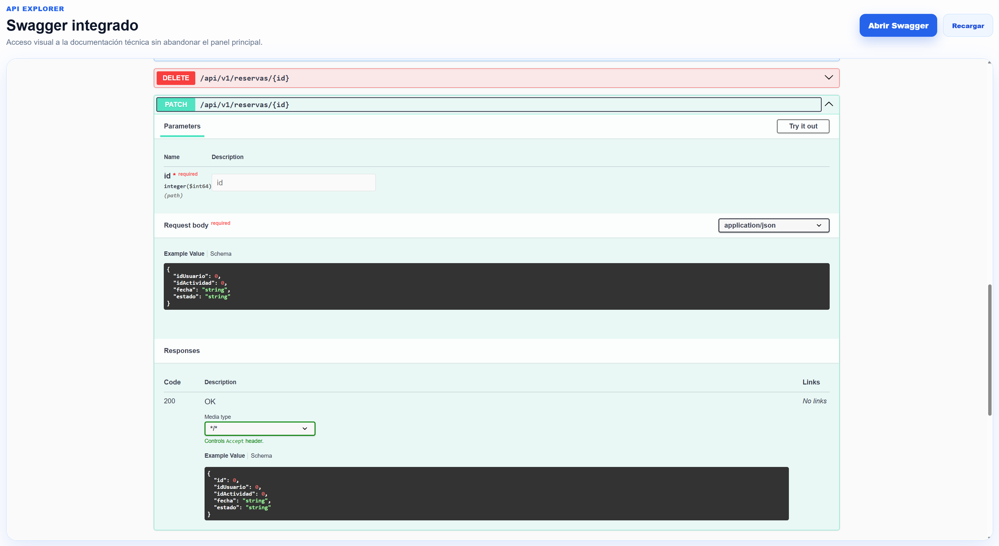

Permite modificar parcialmente los datos de una reserva.

### Ejemplo

```json
{
  "estado": "CANCELADA"
}
```

### Respuesta

```json
{
  "id": 1,
  "idUsuario": 2,
  "idActividad": 3,
  "fecha": "2025-06-15",
  "estado": "CANCELADA"
}
```

---

## Eliminar reserva

**DELETE /api/v1/reservas/{id}**

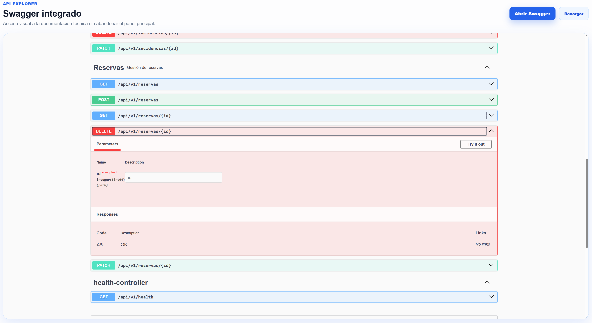

Elimina una reserva existente del sistema.

### Parámetros

| Parámetro | Tipo |
| --------- | ---- |
| id        | Long |

---

# 6.4 Gestión de Incidencias

El módulo de incidencias permite registrar problemas, incidencias técnicas o solicitudes de soporte asociadas a usuarios del sistema.

Cada incidencia contiene información sobre su descripción, estado y fecha de creación.

---

## Obtener incidencias

**GET /api/v1/incidencias**

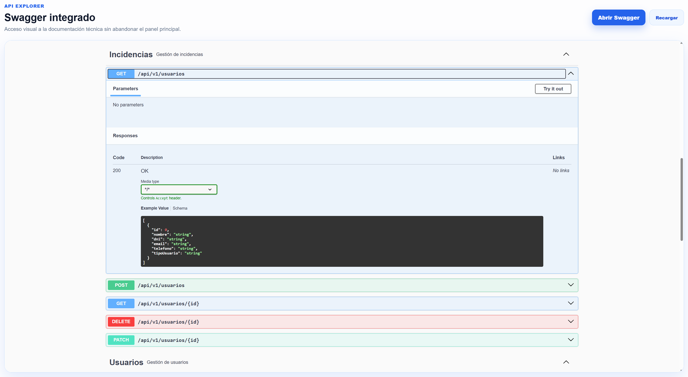

Devuelve el listado completo de incidencias registradas.

### Respuesta

```json
[
  {
    "id": 1,
    "idUsuario": 2,
    "asunto": "Error de acceso",
    "descripcion": "No puedo acceder a la actividad",
    "fecha": "2025-06-15",
    "estado": "ABIERTA"
  }
]
```

---

## Crear incidencia

**POST /api/v1/incidencias**

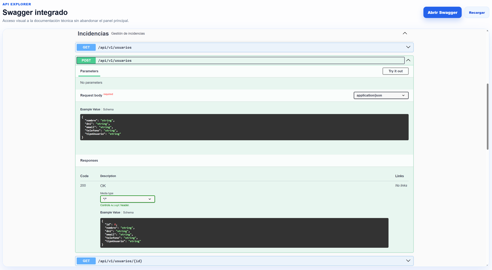

Permite registrar una nueva incidencia.

### Cuerpo de la petición

```json
{
  "idUsuario": 2,
  "asunto": "Error de acceso",
  "descripcion": "No puedo acceder a la actividad",
  "fecha": "2025-06-15",
  "estado": "ABIERTA"
}
```

### Respuesta

```json
{
  "id": 1,
  "idUsuario": 2,
  "asunto": "Error de acceso",
  "descripcion": "No puedo acceder a la actividad",
  "fecha": "2025-06-15",
  "estado": "ABIERTA"
}
```

---

## Obtener incidencia por ID

**GET /api/v1/incidencias/{id}**


Recupera la información de una incidencia concreta mediante su identificador.

### Parámetros

| Parámetro | Tipo |
| --------- | ---- |
| id        | Long |

---

## Actualizar incidencia

**PATCH /api/v1/incidencias/{id}**

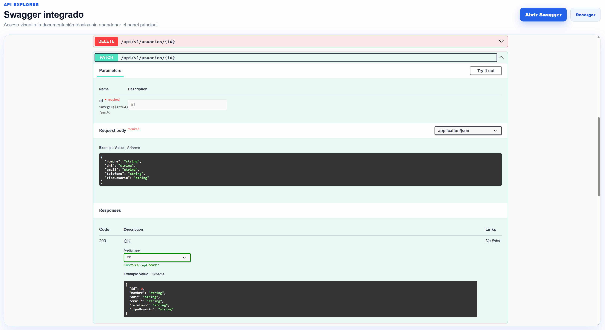

Permite modificar el contenido o estado de una incidencia existente.

### Ejemplo

```json
{
  "estado": "RESUELTA"
}
```

### Respuesta

```json
{
  "id": 1,
  "idUsuario": 2,
  "asunto": "Error de acceso",
  "descripcion": "No puedo acceder a la actividad",
  "fecha": "2025-06-15",
  "estado": "RESUELTA"
}
```

---

## Eliminar incidencia

**DELETE /api/v1/incidencias/{id}**

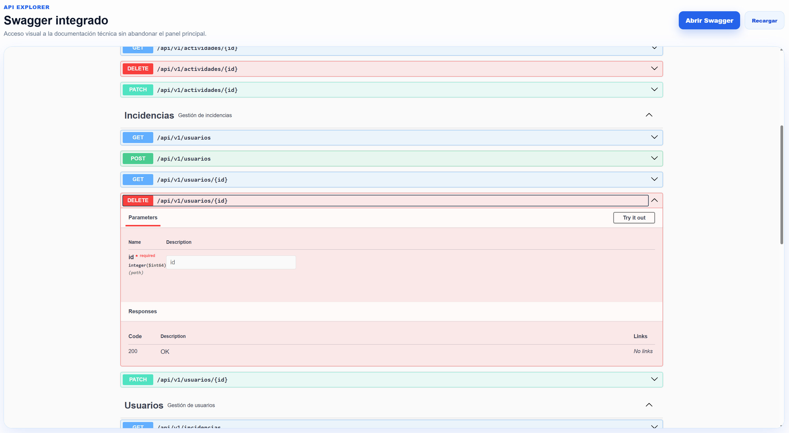

Elimina una incidencia del sistema.

### Parámetros

| Parámetro | Tipo |
| --------- | ---- |
| id        | Long |

---

# 6.5 Monitorización del sistema

Además de los módulos funcionales, la API incorpora un endpoint de monitorización que permite comprobar rápidamente si el servicio se encuentra operativo.

## Health Check

**GET /api/v1/health**

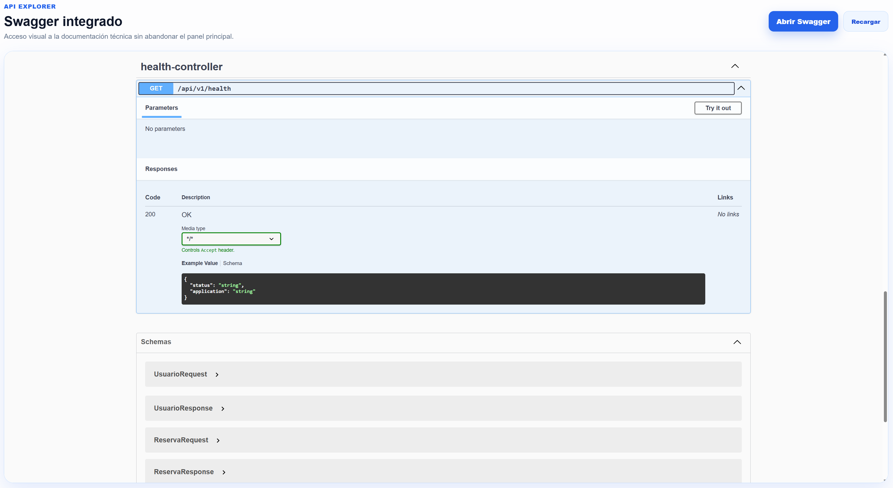

Este endpoint devuelve una respuesta simple indicando que la API está funcionando correctamente.

### Ejemplo de respuesta

```json
{
  "status": "UP"
}
```

### Utilidad

Este endpoint resulta especialmente útil para:

- Verificar la disponibilidad de la API.
- Integración con herramientas de monitorización.
- Comprobaciones automáticas durante despliegues.
- Diagnóstico rápido de incidencias.

---

# 6.6 Schemas y modelos disponibles

Swagger genera automáticamente la definición de los modelos utilizados por la API.

Estos esquemas permiten conocer exactamente la estructura de los datos intercambiados entre cliente y servidor.

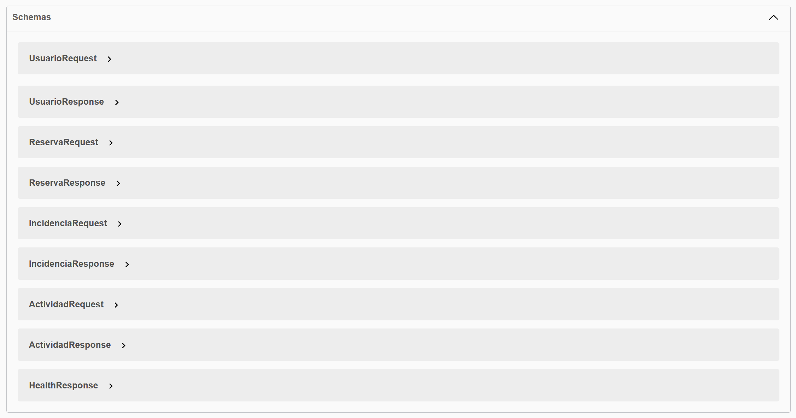

Entre los modelos documentados se encuentran:

## Usuario

```json
{
  "id": 1,
  "nombre": "Juan Pérez",
  "dni": "12345678A",
  "email": "juan@email.com",
  "telefono": "600123123",
  "tipoUsuario": "ALUMNO"
}
```

## Actividad

```json
{
  "id": 1,
  "nombre": "Curso de Java",
  "descripcion": "Programación Java",
  "plazas": 20
}
```

## Reserva

```json
{
  "id": 1,
  "idUsuario": 2,
  "idActividad": 3,
  "fecha": "2025-06-15",
  "estado": "ACTIVA"
}
```

## Incidencia

```json
{
  "id": 1,
  "idUsuario": 2,
  "asunto": "Error de acceso",
  "descripcion": "No puedo acceder a la actividad",
  "fecha": "2025-06-15",
  "estado": "ABIERTA"
}
```

---

# 7. Pruebas de la API mediante Swagger

Swagger UI proporciona una interfaz interactiva que permite probar todos los endpoints sin necesidad de utilizar herramientas externas como Postman.

## Procedimiento de prueba

1. Acceder a Swagger UI.

```text
http://localhost:8080/swagger-ui/index.html
```

2. Seleccionar el endpoint deseado.

3. Pulsar el botón **Try it out**.

4. Introducir los parámetros o el cuerpo JSON necesario.

5. Ejecutar la petición mediante **Execute**.

6. Revisar la respuesta generada por el servidor.

---

## Ventajas de Swagger

- Documentación automática.
- Pruebas rápidas desde navegador.
- Validación de modelos.
- Visualización de respuestas.
- Reducción de errores durante el desarrollo.
- Facilita la integración con otros equipos.

---

# 8. Buenas prácticas de uso

Durante el uso de la API se recomienda:

- Validar siempre los datos enviados.
- Utilizar identificadores válidos.
- Comprobar las respuestas HTTP.
- Gestionar adecuadamente los errores.
- Mantener actualizada la documentación.

---

# 9. Conclusiones

La API REST de CentroPlus Connect proporciona una solución completa para la gestión de:

- Usuarios.
- Actividades.
- Reservas.
- Incidencias.

Gracias al uso de Spring Boot y Swagger/OpenAPI se dispone de una plataforma robusta, mantenible y fácilmente ampliable.

La arquitectura aplicada facilita la separación de responsabilidades y permite evolucionar el sistema sin afectar a otras capas de la aplicación.

Entre las principales características destacan:

- Arquitectura Hexagonal.
- CRUD completo para todas las entidades.
- Persistencia mediante H2 Database.
- Documentación automática con Swagger.
- Testing automatizado con JUnit y Mockito.
- Integración con la aplicación JavaFX.

---

# Autor

**Alejandro Donate García**

GitHub: https://github.com/alejandroDonGar

IES Puerto de la Cruz

Proyecto DAM · CentroPlus Connect

---