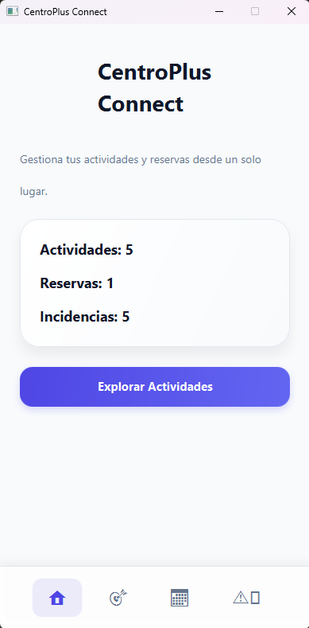
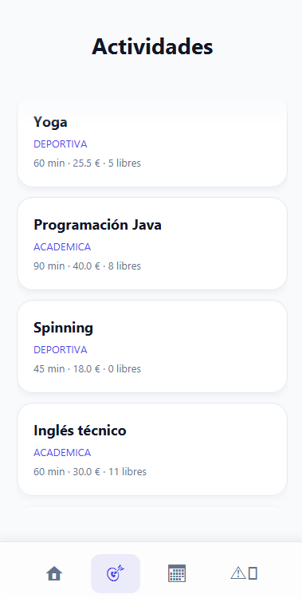
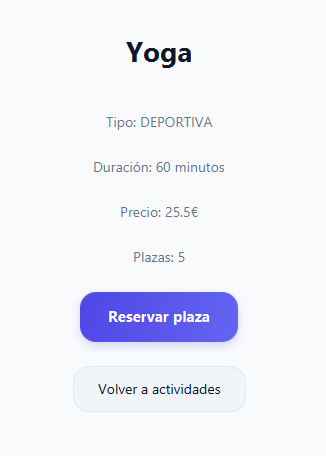
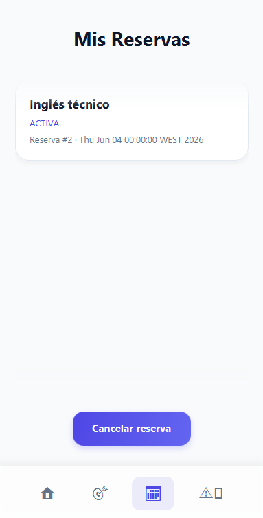
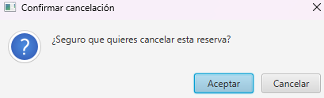
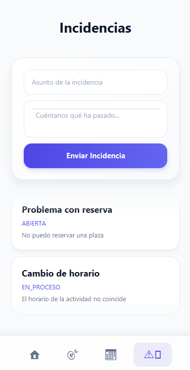

# CentroPlus Connect · Aplicación de Escritorio JavaFX


---

# 1. Introducción

CentroPlus Connect es una aplicación de escritorio desarrollada utilizando JavaFX cuyo objetivo principal es facilitar la gestión de actividades, reservas e incidencias dentro de un entorno educativo.

La aplicación permite centralizar la información relacionada con las actividades ofertadas por el centro, facilitando la inscripción de usuarios, la gestión de reservas y el seguimiento de incidencias mediante una interfaz gráfica intuitiva y sencilla de utilizar.

El sistema ha sido diseñado siguiendo una arquitectura basada en capas, separando claramente la interfaz gráfica, la lógica de negocio y el acceso a los datos.

Esta organización facilita el mantenimiento del proyecto, mejora la reutilización del código y permite futuras ampliaciones de forma sencilla.

---

# 2. Objetivos del proyecto

El desarrollo de CentroPlus Connect persigue diversos objetivos funcionales y técnicos.

## Objetivo general

Desarrollar una aplicación de escritorio que permita gestionar actividades, reservas e incidencias de forma centralizada mediante una interfaz amigable para el usuario.

## Objetivos específicos

* Consultar actividades disponibles.
* Realizar reservas de actividades.
* Gestionar reservas existentes.
* Registrar incidencias.
* Consultar incidencias registradas.
* Mantener la información almacenada en una base de datos SQLite.
* Aplicar principios de programación orientada a objetos.
* Utilizar una arquitectura organizada por capas.
* Facilitar futuras ampliaciones del sistema.

---

# 3. Tecnologías utilizadas

La aplicación ha sido desarrollada utilizando distintas tecnologías que permiten construir una solución robusta y mantenible.

## Java 17

Java constituye el lenguaje principal utilizado durante el desarrollo del proyecto.

Sus principales ventajas son:

* Orientación a objetos.
* Portabilidad.
* Robustez.
* Amplio ecosistema de librerías.

---

## JavaFX

JavaFX se utiliza para la construcción de toda la interfaz gráfica.

Permite:

* Crear interfaces modernas.
* Gestionar eventos visuales.
* Aplicar estilos mediante CSS.
* Separar diseño y lógica mediante FXML.

---

## FXML

FXML permite definir las vistas de la aplicación mediante archivos XML independientes.

Sus ventajas principales son:

* Separación entre diseño y programación.
* Mayor mantenibilidad.
* Reutilización de componentes.

---

## CSS

Las hojas de estilo CSS permiten personalizar la apariencia visual de la aplicación.

Se utilizan para definir:

* Colores.
* Tipografías.
* Bordes.
* Espaciados.
* Sombras.

---

## SQLite

SQLite es el sistema de persistencia utilizado por la aplicación.

Entre sus ventajas destacan:

* No requiere servidor.
* Fácil distribución.
* Bajo consumo de recursos.
* Integración sencilla con aplicaciones Java.

---

## Maven

Maven se utiliza para:

* Gestión de dependencias.
* Compilación del proyecto.
* Ejecución de pruebas.
* Empaquetado de la aplicación.

---

# 4. Arquitectura general

La aplicación ha sido organizada siguiendo una arquitectura por capas.

```text
Interfaz JavaFX
       │
       ▼
Controllers
       │
       ▼
Services
       │
       ▼
Repositories
       │
       ▼
SQLite
```

Cada capa tiene una responsabilidad claramente definida.

---

## Capa de presentación

Está formada por:

```text
FXML
CSS
Controllers
```

Sus responsabilidades son:

* Mostrar información al usuario.
* Gestionar eventos de la interfaz.
* Navegar entre pantallas.

---

## Capa de servicios

Contiene la lógica de negocio de la aplicación.

Entre sus funciones destacan:

* Validación de datos.
* Gestión de reservas.
* Gestión de incidencias.
* Coordinación entre interfaz y persistencia.

---

## Capa de repositorios

Es la encargada de acceder a la base de datos SQLite.

Permite:

* Consultar información.
* Insertar registros.
* Actualizar datos.
* Eliminar registros.

Toda la persistencia de la aplicación se encuentra encapsulada dentro de esta capa.

# 5. Estructura del proyecto

La aplicación se encuentra organizada siguiendo una distribución modular que facilita el mantenimiento y la escalabilidad del código.

La estructura principal del proyecto es la siguiente:

```text
mobile-app
│
├── controller
├── model
├── repository
├── service
├── view
├── database
├── resources
└── css
```

---

## Controller

Los controladores JavaFX son los encargados de gestionar la interacción entre el usuario y la aplicación.

Entre sus responsabilidades se encuentran:

* Capturar eventos de botones.
* Gestionar formularios.
* Navegar entre pantallas.
* Solicitar operaciones a los servicios.

Ejemplos:

```text
HomeController
ActividadController
ReservaController
IncidenciaController
```

---

## Model

La capa de modelos representa las entidades principales del sistema.

Cada clase almacena los datos necesarios para una funcionalidad concreta.

Ejemplos:

```text
Actividad
Reserva
Incidencia
Usuario
```

---

## Service

La capa de servicios contiene la lógica de negocio.

Su objetivo es procesar la información antes de almacenarla o mostrarla.

Entre las operaciones realizadas destacan:

* Validaciones.
* Gestión de reservas.
* Creación de incidencias.
* Cálculo de estadísticas.

---

## Repository

Los repositorios son responsables del acceso a los datos almacenados en SQLite.

Desde esta capa se ejecutan las operaciones CRUD:

* Create
* Read
* Update
* Delete

Además, aíslan completamente la base de datos del resto de la aplicación.

---

## View

La carpeta de vistas contiene todos los archivos FXML.

Estos archivos definen la estructura visual de cada pantalla.

Ejemplos:

```text
home.fxml
actividades.fxml
reservas.fxml
incidencias.fxml
```

---

## Resources

Contiene los recursos estáticos utilizados por la aplicación.

Entre ellos:

* Imágenes.
* Iconos.
* Archivos de configuración.
* Hojas de estilo.

---

# 6. Base de datos

La aplicación utiliza SQLite como sistema de persistencia local.

SQLite permite almacenar toda la información sin necesidad de instalar un servidor de base de datos adicional.

Las principales ventajas de esta solución son:

* Facilidad de despliegue.
* Bajo consumo de recursos.
* Portabilidad.
* Simplicidad de mantenimiento.

---

## Entidades principales

La base de datos se organiza alrededor de cuatro entidades fundamentales:

### Usuarios

Almacena la información de los usuarios del sistema.

Campos principales:

* Identificador.
* Nombre.
* DNI.
* Correo electrónico.
* Teléfono.

---

### Actividades

Contiene las actividades disponibles para reserva.

Campos principales:

* Identificador.
* Nombre.
* Tipo.
* Duración.
* Precio.
* Plazas disponibles.

---

### Reservas

Registra las reservas realizadas por los usuarios.

Campos principales:

* Identificador.
* Usuario.
* Actividad.
* Fecha.
* Estado.

---

### Incidencias

Permite almacenar incidencias notificadas por los usuarios.

Campos principales:

* Identificador.
* Asunto.
* Descripción.
* Fecha.
* Estado.

---

# 7. Flujo general de funcionamiento

El comportamiento general de la aplicación sigue el siguiente esquema:

```text
Usuario
   │
   ▼
Interfaz JavaFX
   │
   ▼
Controller
   │
   ▼
Service
   │
   ▼
Repository
   │
   ▼
SQLite
```

Cuando un usuario realiza una acción:

1. La interfaz captura el evento.
2. El controlador procesa la petición.
3. El servicio aplica la lógica de negocio.
4. El repositorio accede a la base de datos.
5. Los resultados vuelven a mostrarse en pantalla.

Este flujo garantiza una correcta separación de responsabilidades y facilita el mantenimiento futuro del proyecto.

# 8. Interfaz gráfica y navegación

La aplicación ha sido diseñada siguiendo criterios de simplicidad, claridad visual y facilidad de uso.

Su objetivo principal es permitir al usuario consultar actividades, gestionar reservas y registrar incidencias mediante una interfaz intuitiva y accesible.

La navegación entre las distintas pantallas se realiza mediante los controles integrados en la propia interfaz, facilitando una experiencia de uso fluida y consistente.

---

# 8.1 Pantalla principal

La pantalla principal constituye el punto de entrada de la aplicación.

Desde ella el usuario puede obtener una visión general del estado del sistema mediante distintos indicadores informativos.

Entre los datos mostrados se encuentran:

* Número total de actividades disponibles.
* Número de reservas registradas.
* Número de incidencias almacenadas.

Además, se proporciona acceso directo al catálogo de actividades mediante el botón principal de exploración.



La información mostrada se actualiza automáticamente utilizando los datos almacenados en la base de datos SQLite.

Esta pantalla permite al usuario conocer rápidamente el estado general del sistema sin necesidad de acceder a otros apartados.

---

# 8.2 Catálogo de actividades

El módulo de actividades muestra todas las actividades disponibles organizadas en forma de tarjetas.

Cada tarjeta incluye la información más relevante para el usuario:

* Nombre de la actividad.
* Categoría.
* Duración.
* Precio.
* Número de plazas disponibles.



La organización mediante tarjetas facilita la lectura de la información y permite localizar rápidamente las actividades disponibles.

Esta pantalla constituye el principal punto de acceso al sistema de reservas.

---

# 8.3 Detalle de actividad

Al seleccionar una actividad concreta se accede a una pantalla de detalle.

En esta vista se muestran todos los datos asociados a la actividad seleccionada:

* Tipo de actividad.
* Duración.
* Precio.
* Número de plazas disponibles.



Desde esta pantalla el usuario puede realizar directamente una reserva mediante el botón **Reservar plaza**.

El sistema verifica automáticamente la disponibilidad antes de registrar la operación.

En caso de no existir plazas libres, la reserva no podrá completarse.

---

# 8.4 Diseño visual

Toda la interfaz ha sido desarrollada utilizando JavaFX, FXML y CSS.

Los estilos aplicados siguen una línea visual moderna basada en:

* Colores suaves y consistentes.
* Botones destacados para las acciones principales.
* Tipografía clara y legible.
* Distribución organizada de los elementos visuales.
* Espaciado uniforme entre componentes.

Estas características permiten mejorar la experiencia de usuario y facilitan el acceso a las funcionalidades principales del sistema.

El diseño ha sido planteado para ofrecer una navegación sencilla incluso para usuarios sin experiencia previa en el uso de aplicaciones de gestión.

# 9. Gestión de reservas

El sistema permite a los usuarios realizar reservas sobre las actividades disponibles dentro de la aplicación.

Cada reserva queda registrada en la base de datos y asociada tanto al usuario como a la actividad seleccionada.

Además, el sistema controla automáticamente la disponibilidad de plazas para evitar sobreocupaciones.

---

# 9.1 Creación de reservas

Las reservas se generan desde la pantalla de detalle de cada actividad.

Cuando el usuario selecciona una actividad y pulsa el botón de reserva, la aplicación realiza las siguientes operaciones:

1. Comprueba que la actividad dispone de plazas libres.
2. Registra la reserva en la base de datos.
3. Actualiza automáticamente las plazas ocupadas.
4. Refresca la información mostrada en pantalla.

Este comportamiento garantiza que la disponibilidad mostrada sea siempre coherente con los datos almacenados.

---

# 9.2 Consulta de reservas

La aplicación dispone de un módulo específico para visualizar todas las reservas registradas.

En esta pantalla se muestran los datos más relevantes de cada reserva:

* Identificador.
* Usuario asociado.
* Actividad reservada.
* Fecha.
* Estado.



Esta vista permite consultar rápidamente toda la información relacionada con las inscripciones realizadas en el sistema.

---

# 9.3 Estados de reserva

Cada reserva puede encontrarse en distintos estados según su situación actual.

Los estados utilizados por la aplicación son:

| Estado | Descripción |
|----------|-------------|
| ACTIVA | Reserva válida y operativa |
| CANCELADA | Reserva anulada por el usuario |
| FINALIZADA | Actividad ya realizada |

El estado permite identificar rápidamente la situación de cada inscripción.

---

# 9.4 Cancelación de reservas

Cuando un usuario desea eliminar una reserva existente, la aplicación solicita una confirmación previa para evitar borrados accidentales.

Antes de completar la operación aparece una ventana de confirmación.



El usuario puede:

* Confirmar la eliminación.
* Cancelar la operación.

---

# 9.5 Actualización automática de plazas

Una de las funcionalidades más importantes implementadas en el proyecto es la gestión automática de plazas disponibles.

Cuando se registra una reserva:

* Las plazas ocupadas aumentan en una unidad.
* Las plazas disponibles disminuyen automáticamente.

Cuando una reserva es eliminada:

* Las plazas ocupadas disminuyen.
* Las plazas disponibles vuelven a incrementarse.

Este mecanismo garantiza la integridad de los datos almacenados y evita inconsistencias en la disponibilidad de actividades.

---

# 9.6 Validaciones implementadas

Durante la creación de reservas la aplicación realiza diversas comprobaciones:

* Existencia de la actividad seleccionada.
* Disponibilidad de plazas.
* Correcta asociación con el usuario.
* Integridad de los datos introducidos.

Si alguna validación falla, la reserva no es registrada.

De esta forma se evita la creación de registros incorrectos dentro del sistema.

# 10. Gestión de incidencias

El módulo de incidencias permite registrar, consultar y realizar el seguimiento de problemas o solicitudes comunicadas por los usuarios.

Esta funcionalidad facilita la comunicación entre los usuarios y los responsables del sistema, permitiendo mantener un control organizado de todas las incidencias registradas.

---

# 10.1 Consulta de incidencias

La aplicación dispone de una pantalla específica para visualizar todas las incidencias almacenadas.

Cada registro muestra información relevante sobre el problema comunicado:

* Asunto.
* Descripción.
* Fecha de creación.
* Estado actual.



Esta vista permite consultar rápidamente la situación de todas las incidencias existentes en el sistema.

---

# 10.2 Registro de incidencias

Los usuarios pueden crear nuevas incidencias mediante un formulario integrado en la aplicación.

Para registrar una incidencia es necesario introducir:

* Asunto.
* Descripción.
* Fecha.
* Estado inicial.

La aplicación valida la información antes de almacenarla en la base de datos.

Una vez completado el formulario, la incidencia queda registrada y pasa a formar parte del listado general.

---

# 10.3 Estados de incidencia

Cada incidencia puede encontrarse en uno de los siguientes estados:

| Estado | Descripción |
|----------|-------------|
| ABIERTA | Incidencia recién registrada |
| EN_PROCESO | Incidencia actualmente en revisión |
| RESUELTA | Incidencia solucionada |

Estos estados permiten conocer rápidamente el progreso de cada incidencia.

---

# 10.4 Seguimiento de incidencias

El sistema facilita el seguimiento de las incidencias mediante la visualización de su estado actual.

Esto permite:

* Detectar incidencias pendientes.
* Identificar incidencias resueltas.
* Organizar el trabajo de mantenimiento.
* Mejorar el control de incidencias abiertas.

---

# 10.5 Validaciones implementadas

Durante la creación de incidencias se realizan diversas comprobaciones para garantizar la calidad de los datos almacenados.

Entre las validaciones implementadas destacan:

* Comprobación de campos obligatorios.
* Validación del contenido introducido.
* Verificación de formatos.
* Prevención de registros incompletos.

Estas validaciones ayudan a mantener la consistencia de la información almacenada en el sistema.

---

# 10.6 Beneficios del sistema de incidencias

La incorporación de este módulo aporta diversas ventajas:

* Centralización de problemas reportados.
* Seguimiento estructurado de incidencias.
* Mejora de la comunicación interna.
* Historial completo de incidencias registradas.
* Mayor control sobre el mantenimiento del sistema.

Gracias a esta funcionalidad es posible gestionar de forma eficiente cualquier incidencia detectada durante el uso de la aplicación.

# 11. Persistencia de datos

La aplicación utiliza SQLite como sistema de almacenamiento local.

Todas las operaciones realizadas por el usuario se almacenan de forma permanente en la base de datos, permitiendo conservar la información incluso después de cerrar la aplicación.

Entre los datos almacenados se encuentran:

* Usuarios.
* Actividades.
* Reservas.
* Incidencias.

La persistencia se gestiona mediante una capa de repositorios que encapsula completamente el acceso a la base de datos.

---

# 11.1 Ventajas de SQLite

SQLite ha sido seleccionado por las siguientes razones:

* No requiere servidor externo.
* Fácil distribución junto con la aplicación.
* Bajo consumo de recursos.
* Configuración mínima.
* Excelente rendimiento para aplicaciones de escritorio.

---

# 11.2 Integridad de los datos

La aplicación implementa distintos mecanismos para garantizar la consistencia de la información almacenada.

Entre ellos destacan:

* Validación de campos obligatorios.
* Control de identificadores.
* Comprobación de relaciones entre entidades.
* Gestión automática de plazas disponibles.

Estas validaciones reducen la posibilidad de almacenar información incorrecta.

---

# 12. Validaciones implementadas

Durante el desarrollo se han incorporado diferentes mecanismos de validación para mejorar la fiabilidad del sistema.

---

## Validación de actividades

Antes de realizar una reserva se comprueba:

* Existencia de la actividad.
* Disponibilidad de plazas.
* Correcta carga de los datos.

Si una actividad no dispone de plazas libres no será posible completar la reserva.

---

## Validación de reservas

Durante la creación de reservas se verifica:

* Existencia del usuario.
* Existencia de la actividad.
* Disponibilidad de plazas.
* Integridad de la información introducida.

Además, la cancelación de reservas actualiza automáticamente las plazas disponibles.

---

## Validación de incidencias

Las incidencias requieren información mínima obligatoria:

* Asunto.
* Descripción.
* Estado.

Si alguno de estos datos no se proporciona, la incidencia no podrá registrarse correctamente.

---

## Gestión de errores

La aplicación incorpora mecanismos de control de errores para evitar cierres inesperados.

Cuando se produce una situación no válida:

* Se informa al usuario.
* Se evita la inserción de datos incorrectos.
* Se mantiene la integridad de la información almacenada.
# 13. Pruebas realizadas

Durante el desarrollo del proyecto se realizaron diferentes pruebas con el objetivo de verificar el correcto funcionamiento de todas las funcionalidades implementadas.

Las pruebas se centraron principalmente en:

* Gestión de actividades.
* Gestión de reservas.
* Gestión de incidencias.
* Persistencia de datos.
* Navegación entre pantallas.
* Validación de formularios.

---

## Pruebas de actividades

Se verificó correctamente:

* La visualización del catálogo de actividades.
* La carga de información detallada.
* El cálculo de plazas disponibles.
* La actualización automática de los datos mostrados.

---

## Pruebas de reservas

Las pruebas realizadas permitieron comprobar:

* Creación correcta de reservas.
* Asociación entre usuario y actividad.
* Actualización automática de plazas ocupadas.
* Recuperación de plazas tras cancelar una reserva.
* Visualización correcta del listado de reservas.

---

## Pruebas de incidencias

Se verificó el correcto funcionamiento de:

* Creación de incidencias.
* Visualización del listado.
* Actualización de estados.
* Persistencia de la información almacenada.

---

## Pruebas de persistencia

Se realizaron pruebas específicas sobre SQLite para verificar:

* Inserción de registros.
* Modificación de datos.
* Eliminación de registros.
* Recuperación de información almacenada.

Los resultados obtenidos confirmaron el correcto funcionamiento de la capa de persistencia.

---

# 14. Resultados obtenidos

Tras la finalización del desarrollo se consiguió implementar una aplicación completamente funcional capaz de gestionar las principales necesidades del sistema CentroPlus Connect.

Entre los resultados alcanzados destacan:

* Gestión completa de actividades.
* Gestión completa de reservas.
* Gestión completa de incidencias.
* Persistencia local mediante SQLite.
* Interfaz gráfica moderna desarrollada con JavaFX.
* Navegación intuitiva entre pantallas.
* Separación clara de responsabilidades mediante arquitectura por capas.

El sistema cumple los objetivos planteados durante la fase de diseño y proporciona una base sólida para futuras ampliaciones.

---

# 15. Posibles mejoras futuras

Aunque la aplicación cumple plenamente los objetivos definidos inicialmente, existen diversas funcionalidades que podrían incorporarse en futuras versiones.

Entre las mejoras propuestas destacan:

* Sistema de autenticación de usuarios.
* Gestión de roles y permisos.
* Notificaciones automáticas.
* Exportación de datos a PDF y Excel.
* Integración directa con la API REST.
* Sincronización en tiempo real.
* Estadísticas avanzadas.
* Panel administrativo completo.
* Gestión documental.
* Sistema de búsqueda avanzada.

Estas mejoras permitirían ampliar significativamente las capacidades de la aplicación.

---

# 16. Conclusiones

CentroPlus Connect ha permitido aplicar de forma práctica los conocimientos adquiridos durante el ciclo formativo de Desarrollo de Aplicaciones Multiplataforma.

Durante el desarrollo se han utilizado tecnologías ampliamente empleadas en entornos profesionales como Java, JavaFX, SQLite, Maven y Spring Boot.

El proyecto ha permitido trabajar aspectos fundamentales del desarrollo software:

* Programación orientada a objetos.
* Arquitectura por capas.
* Persistencia de datos.
* Desarrollo de interfaces gráficas.
* Testing.
* Gestión de proyectos.

El resultado final es una solución funcional, mantenible y escalable que demuestra la aplicación práctica de los conocimientos adquiridos durante la formación.

---

# Autor

**Alejandro Donate García**

GitHub:

https://github.com/alejandroDonGar

IES Puerto de la Cruz

Proyecto DAM · CentroPlus Connect

---