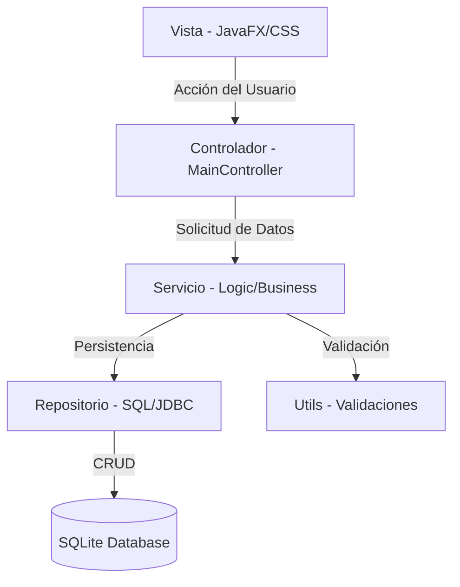

# Arquitectura del Sistema - CentroPlus Connect

Este documento describe la arquitectura de software detallada utilizada en el proyecto **CentroPlus Connect**.

## Patrón de Diseño: MVC (Modelo-Vista-Controlador)

La aplicación implementa una arquitectura robusta basada en la separación de responsabilidades:



### Componentes Principales

#### 1. Capa de Presentación (Vista)
Gestionada mediante JavaFX y un archivo de estilos personalizado.
- **[estilos.css](file:///e:/centroplus-connect/mobile-app/src/main/resources/es/ies/puerto/css/estilos.css)**: Implementa un diseño "Modern Light" con animaciones graduales y efectos de desvanecimiento.

#### 2. Capa de Control (MainController)
Gestiona la navegación y la interacción.
```java
// Ejemplo de navegación dinámica en MainController
private void mostrarInicio() {
    actualizarNavActivo(0);
    VBox contenido = crearContenedorPantalla();
    // ... lógica de construcción de la vista ...
    root.setCenter(contenido);
}
```

#### 3. Capa de Servicio (Lógica de Negocio)
Aísla la lógica de la aplicación del acceso a datos.
- **Interfaces**: Definen el contrato de servicios (ej. `IActividadService`).
- **Implementaciones**: Contienen la lógica, como `ActividadService`.

#### 4. Capa de Repositorio (Persistencia)
Gestiona el acceso a la base de datos SQLite mediante JDBC.
```java
// Ejemplo de consulta en ActividadRepository
@Override
public List<Actividades> findAll() {
    String sql = "SELECT id, nombre, tipo_actividad, duracion, precio, plazas_maximas, plazas_ocupadas FROM actividades";
    // ... ejecución JDBC ...
}
```

## Flujo de Datos
1. El usuario interactúa con la UI (ej. pulsa "Reservar").
2. El `MainController` llama al método correspondiente del `Service`.
3. El `Service` valida los datos usando `Validaciones.java`.
4. Si es correcto, el `Service` pide al `Repository` persistir el cambio.
5. El `Repository` ejecuta la sentencia SQL mediante `Sqlite3Manager`.
6. La UI se actualiza reflejando el cambio.

## Testing
Se utiliza un enfoque de **Tests Unitarios Aislados**:
- **JUnit 5**: Para la estructura de los tests.
- **Mockito**: Para simular la capa de Repositorio desde los Servicios.
