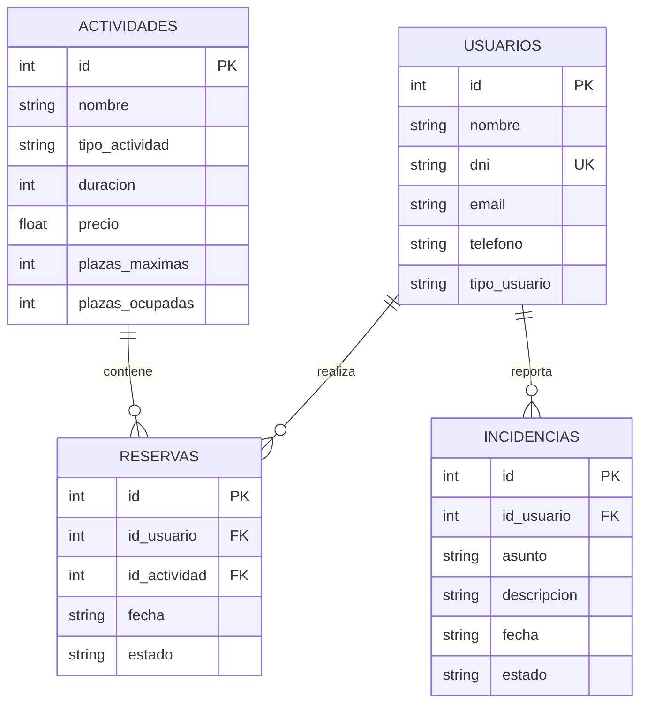

# Documentación de la Base de Datos - CentroPlus Connect

Este documento detalla el diseño y la implementación de la persistencia de datos.

## Modelo Entidad-Relación

La base de datos se basa en cuatro entidades principales relacionadas entre sí:



## Implementación SQL

### Creación de Tablas (DDL)
El esquema se define en `database/schema.sql`. Ejemplo de creación de la tabla `reservas`:
```sql
CREATE TABLE reservas (
    id INTEGER PRIMARY KEY,
    id_usuario INTEGER NOT NULL,
    id_actividad INTEGER NOT NULL,
    fecha TEXT NOT NULL,
    estado TEXT NOT NULL,
    FOREIGN KEY (id_usuario) REFERENCES usuarios(id),
    FOREIGN KEY (id_actividad) REFERENCES actividades(id)
);
```

### Datos de Ejemplo (DML)
Para pruebas, disponemos de `database/seed.sql` con datos precargados:
```sql
INSERT INTO actividades (nombre, tipo_actividad, duracion, precio, plazas_maximas, plazas_ocupadas)
VALUES ('Yoga', 'DEPORTIVA', 60, 25.50, 15, 8);
```

## Gestión de Conexiones
La clase `Sqlite3Manager` implementa el patrón Singleton para asegurar una única conexión eficiente:
- **JDBC URL**: `jdbc:sqlite:path/to/centroplus.db`
- **Integridad**: `PRAGMA foreign_keys = ON;` activado por defecto.
